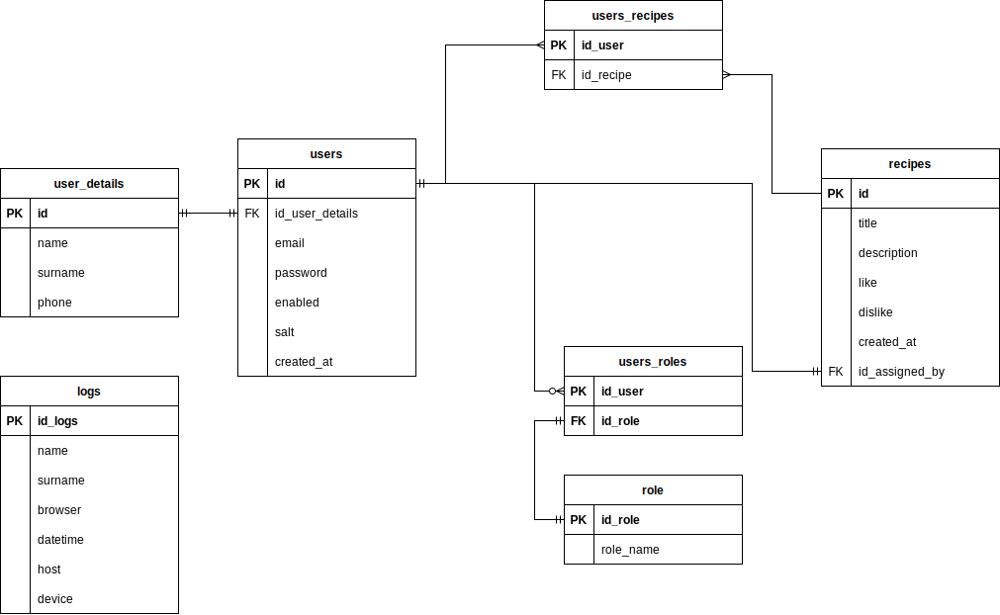

# FEEDMI
In this application you can find interesting recipes, add your ideas and run your own blog.

# Technologies used:

HTML

CSS

PHP

SQL

JavaScript

Docker

The initial prototype of the app is saved as 'feedmi_prototipe.pdf'.

[embed]https://github.com/maciekkk00/FEEDMI/blob/main/FEEDMI.pdf[/embed]

# ERD of the database:

